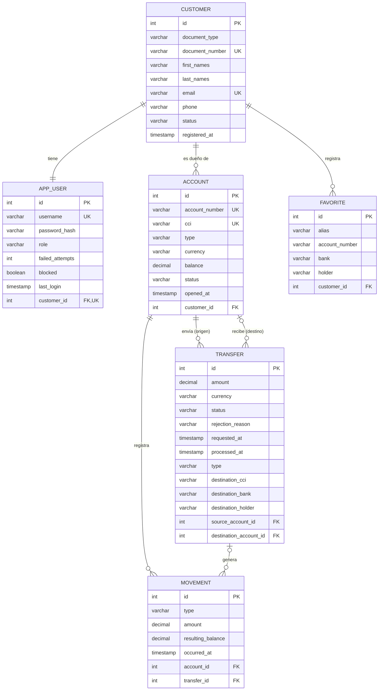

# Mini-Bank-App

## ¿Qué es MiniBank?

MiniBank es un banco digital pequeño. Permite que una persona se registre como cliente, abra sus cuentas y maneje su dinero desde la aplicación, sin ir a una agencia.

Con MiniBank un cliente puede:

- **Registrarse** con su documento de identidad, nombre, correo y teléfono.
- **Ingresar a la app** con su usuario y contraseña. Si se equivoca varias veces seguidas, su acceso se bloquea para protegerlo.
- **Tener una o varias cuentas** en soles o en dólares, cada una con su número de cuenta y su CCI.
- **Transferir dinero** a otras cuentas de MiniBank o de otros bancos.
- **Guardar beneficiarios**, es decir, las cuentas a las que envía dinero seguido, para no escribir los datos cada vez.
- **Ver sus movimientos**: cada ingreso y cada salida de dinero queda registrado con el saldo que quedó después.

El proyecto está hecho con **Spring Boot** y sigue una **arquitectura hexagonal**.

## Modelo de datos (ERD)

- Tablas: [init.sql](init.sql)
- Datos de prueba: [test-data.sql](test-data.sql) (borra y vuelve a cargar los datos)

## Casos de uso implementados

Los endpoints `/api/me/...` requieren `Authorization: Bearer <token>`.

| Caso de uso | Endpoint | Descripción |
|---|---|---|
| Login | `POST /api/auth/login` | Valida usuario y contraseña y devuelve un token JWT. |
| Agregar favorito | `POST /api/me/favorites` | Guarda una cuenta de destino frecuente con un alias. |
| Listar favoritos | `GET /api/me/favorites` | Devuelve todos mis favoritos. |
| Ver favorito | `GET /api/me/favorites/{id}` | Devuelve un favorito por su id. |
| Buscar favorito por alias | `GET /api/me/favorites/alias/{alias}` | Devuelve un favorito por su alias. |
| Hacer transferencia | `POST /api/me/transfers` | Envía dinero desde una cuenta mía a otra cuenta de MiniBank o de otro banco. |
| Ver transferencia | `GET /api/me/transfers/{id}` | Devuelve una transferencia que envié o recibí. |
| Listar transferencias | `GET /api/me/transfers?accountId=` | Devuelve las transferencias enviadas desde una de mis cuentas. |
| Ver movimiento | `GET /api/me/movements/{id}` | Devuelve un movimiento de una de mis cuentas. |
| Listar movimientos | `GET /api/me/movements?accountId=` | Devuelve los ingresos y salidas de una de mis cuentas. |

## Cómo probar

- Usuarios de [test-data.sql](test-data.sql): `demo/demo123`, `admin/admin123`, `maria/maria123`, `pedro/pedro123` (bloqueado).